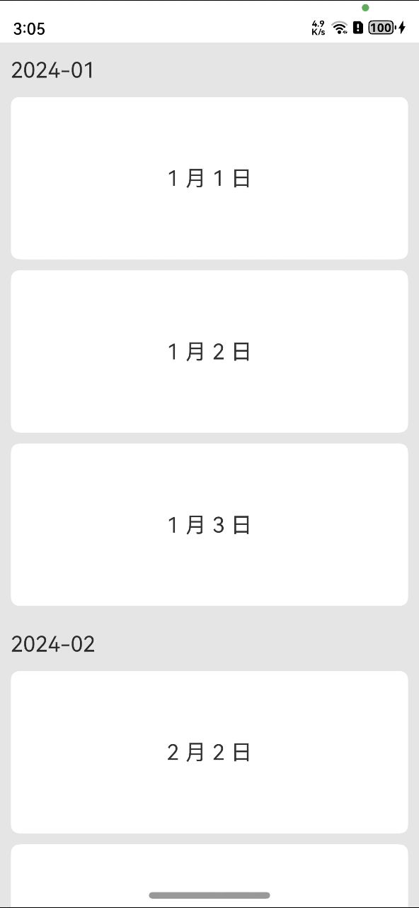

## PullToRefreshForHead

A component for HarmonyOS that can simultaneously implement dynamic grouping lists for pull-down refreshing and pull-up loading. 

### ScreenShot:



### **Download**

```Nginx
ohpm install @ohos/pulltorefreshForHead
```

### **Usage**

```TypeScript
@State data: GroupData[] = [];
@State headTitle: GroupData = new GroupData()
@State showFakeHead: boolean = true
// need bind to list
private scroller: Scroller = new Scroller();
@State private dataModel: PullRefreshModel = new PullRefreshModel()
private itemDataGroupNew: GroupData[] = [....]// 假数据省略

@Builder
private getListView() {
    // first item，pull-down refreshing component
    RefreshLayout({
      refreshLayoutClass: new CustomRefreshLoadLayoutClass(this.dataModel.isVisiblePullDown, this.dataModel.pullDownRefreshImage,
    this.dataModel.pullDownRefreshText, this.dataModel.pullDownRefreshHeight)
    })

   // 1. placeholder head
  Row() {
    this.itemHead()
  }
  .visibility(this.showFakeHead? Visibility.Visible : Visibility.None)

  List({space:20, scroller: this.scroller }) {
    ListItem() {
      Row() {
          // 2. the head of 
        this.itemHead()
      }.visibility(!this.showFakeHead? Visibility.Visible : Visibility.None)
    }

    ForEach(this.data, (item: GroupData) => {
      ListItem() {
        Column() {
          Row() {
            // 3. the head of list,will scroll
            Text(item.head)
              .fontSize(20)
              .height(50)
              .backgroundColor('#FF667075')
              .width('100%')
          }.visibility(item.isHead ? Visibility.Visible : Visibility.None)

          Text(item.content)
            .width('100%')
            .height(150)
            .fontSize(20)
            .textAlign(TextAlign.Center)
            .backgroundColor('#FF6600')
            .visibility(!item.isHead ? Visibility.Visible : Visibility.None)
        }
      }
    })
    // last item,pull-up loading component
    ListItem() {
      if (this.dataModel.hasMore) {
        LoadMoreLayout({
          loadMoreLayoutClass: new CustomRefreshLoadLayoutClass(this.dataModel.isVisiblePullUpLoad, this.dataModel.pullUpLoadImage,
            this.dataModel.pullUpLoadText, this.dataModel.pullUpLoadHeight)
        })
      } else {
        NoMoreLayout()
      }
    }
  }
  .onTouch((event: TouchEvent | undefined) => {
    if (event) {
      if (this.dataModel.pageState === PageState.Success) {
        // dispatch touch event
        listTouchEvent(this.dataModel, event, (isLoadMore: boolean) => {
          this.getData(isLoadMore)
        });
      }
    }
  })
  .onScrollIndex((start: number, end: number) => {
    console.log(`headfloat start:${start}`)
    if (this.data.length > start) {
      let startValue = this.data[start]
      // 4. set value to head item
      this.headTitle = startValue
    }
    let yOffset: number = this.scroller.currentOffset().yOffset
    if (yOffset >= -0.01) {
        // 5. control head to show or not
      this.showFakeHead = true
    } else {
      this.showFakeHead = false
    }
    this.dataModel.startIndex = start;
    this.dataModel.endIndex = end;
  })
  .backgroundColor('#eeeeee')
  .edgeEffect(EdgeEffect.None)
}
```

### Component

1. RefreshLayout：pull-down refreshing component
2. itemHead：group title
3. LoadMoreLayout：pull-up loading component
4. NoMoreLayout：no more data component
5. PullRefreshModel： model class used to control pull-down refresh and pull-up loading status recording 

### Limitations

Verified in the following versions: 

- DevEco Studio: 4.1 Canary(4.1.3.500), SDK: API11 (4.1.0)

Theoretically, it also supports versions of API 9 and 10.

### Contribute code

If you find any problems during use, you can submit an Issue to us. Of course, we also welcome you to send us a PR